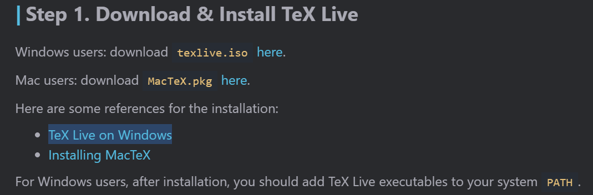
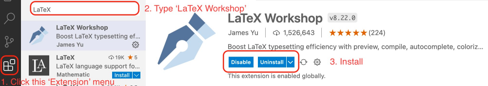
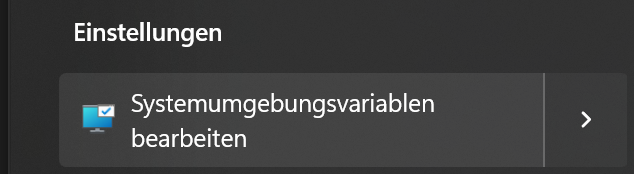
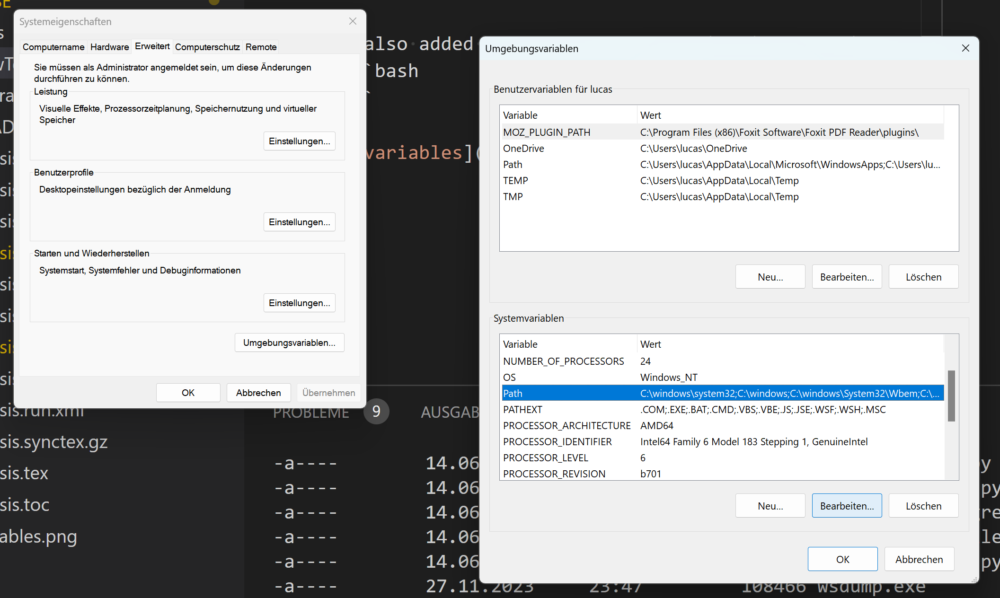
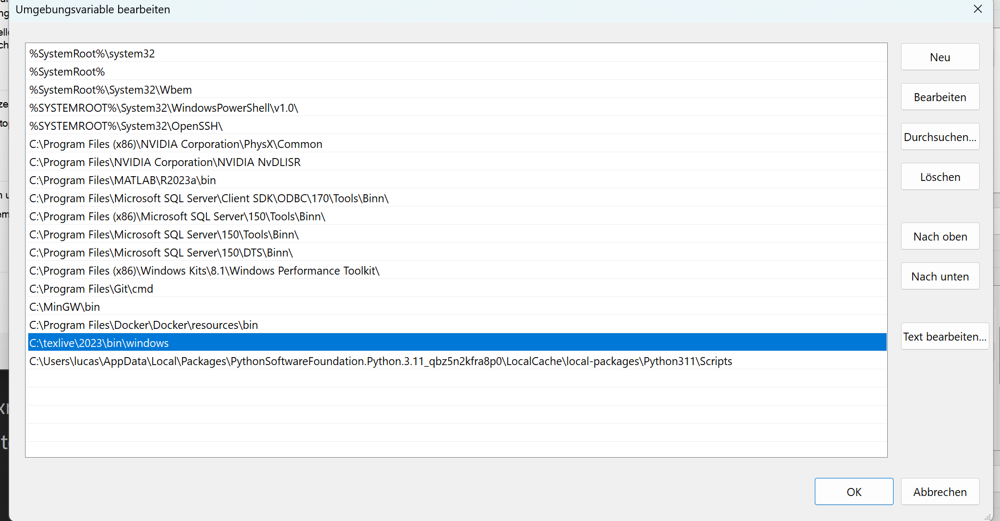

# Using LateX on your own machine within vsCode

---
<br>

# Installation
First visit *Jia Jia's [Homepage](https://mathjiajia.github.io/vscode-and-latex/)* for an easy installation guide.

<br>

- **Step 1**:
        
    Go to the references for the installation and press 'TeX Live on Windows':


    Next press 'Easy install' and 'install-tl-windows.exe'.

    Might take up to 30mins.
    
    After downloading the installer run the installation (just press installation).
    
    `For Windows users, after installation, you should add TeX Live executables to your system PATH.` see [here](#add-system-paths).

<br>

- **Step 2**: (installing vscode)

<br>

- **Step 3**:

    Install **LaTeX Workshop extension**
    


<br>

- **Step 4**:

    Install **Pygments**
    ```bash
    pip3 install Pygments
    ```


# Promblems


## Add System Paths
If you are getting error that `pygmentize` is not known or `\label` and `\ref` is not working.

Change directory to the path where your python3 packages are located (on my system it is):
```bash
cd C:\users\lucas\appdata\local\packages\<your-python3-version>\localcache\local-packages\python311\Scripts
```
If the texLive installer is done, there should be a `pygmentize.exe`, check for it.

It's asolute path needs to be added to Sys-env-var/Path: `system-environment-variables`

I also added the installation path of TexLive (C:\texlive\2023\bin\windows on my machine)



Press on `edit`



As you can see I added the two missing paths:


Go to vscode `settings.json` and add the following inside the '{}':


```json
"latex-workshop.latex.tools": [
        {
         "name": "latexmk",
         "command": "latexmk",
         "args": [
          "-synctex=1",
          "-interaction=nonstopmode",
          "-file-line-error",
          "-pdf",
          "-outdir=%OUTDIR%",
          "%DOC%"
         ],
         "env": {}
        },
        {
         "name": "xelatex",
         "command": "xelatex",
         "args": [
          "-synctex=1",
          "-interaction=nonstopmode",
          "-file-line-error",
          "%DOC%"
         ],
         "env": {}
        },
        {
         "name": "pdflatex",
         "command": "pdflatex",
         "args": [
          "-shell-escape",
          "-synctex=1",
          "-interaction=nonstopmode",
          "-file-line-error",
          "%DOC%"
         ],
         "env": {}
        },
        {
         "name": "bibtex",
         "command": "bibtex",
         "args": [
          "%DOCFILE%"
         ],
         "env": {}
        }
       ],

       "latex-workshop.latex.recipes": [
        {
         "name": "pdfLaTeX",
         "tools": [
          "pdflatex"
         ]
        },
        {
         "name": "latexmk 🔃",
         "tools": [
          "latexmk"
         ]
        },
        {
         "name": "xelatex",
         "tools": [
          "xelatex"
         ]
        },
        {
         "name": "pdflatex ➞ bibtex ➞ pdflatex`×2",
         "tools": [
          "pdflatex",
          "bibtex",
          "pdflatex"
         ]
        },
        {
        "name": "xelatex ➞ bibtex ➞ xelatex`×2",
        "tools": [
          "xelatex",
          "bibtex",
          "xelatex",
          "xelatex"
         ]
        }
       ],
```
Then restart your system and try to build the `.tex` file again.